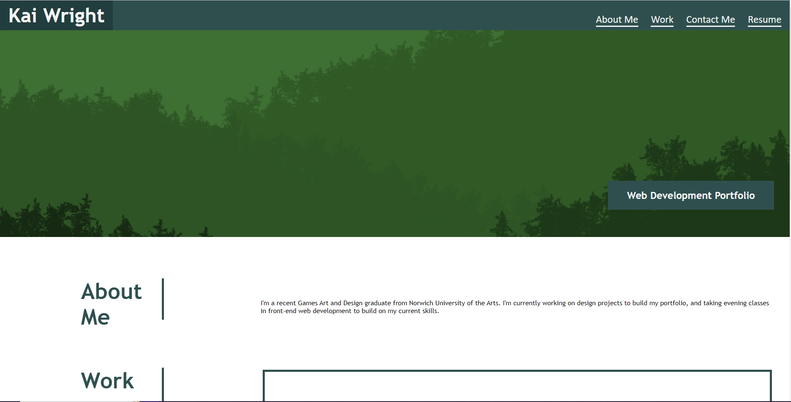
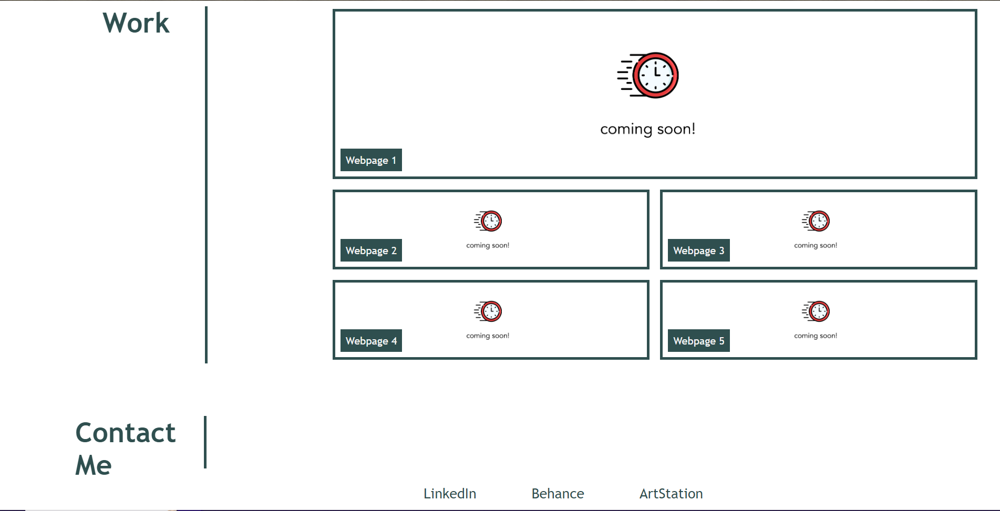

# Personalised Portfolio - Week 2 Challenge

## Description

The aim of this project was to make a portfolio to display my future projects as a web developer. This was done through creating different sections for each part of my portfolio and creating boxes to display future work. In this project, I got a lot more practice using CSS flexbox and grid. I also got better with using media queries. 

## Installation

Website deploys at live URL
Link: https://kaiwright.github.io/Week2_Challenge/

## Usage

The website deploys from the link above. All navigations links take the user to the corresponding section, and the 'Resume' button downloads a copy of my CV.  

## License

MIT License
